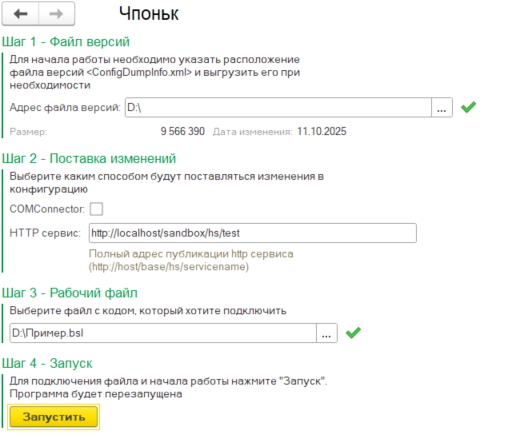
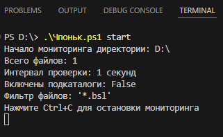
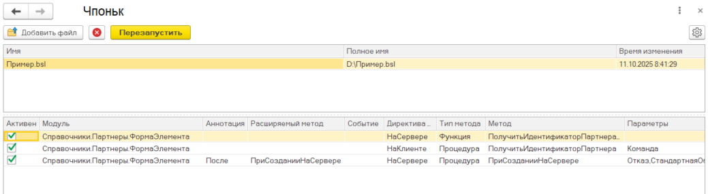

Выполняет код из файла без перезагрузки 1с

## Возможности

- Позволяет "создавать" новые методы в тексте файла без перезагрузки
- Поддержка аннотаций &Перед, &Вместо и &После
- Подключение нескольких файлов
- Управление активностью методов подключенных файлов из панели управления
- В одном файле могут быть методы из разных модулей

## Ограничения

- Нет отладки
- При добавлении «нового» модуля или события требуется перезапуск
- Нет поддержки асинхронных методов и обработчиков оповещения

## Требования

- ОС Windows
- Платформа 8.3.18 и выше
- COMConnector или публикация ИБ на веб-сервере
- Управляемые формы

## Использование

### Первый запуск

Для начала работы необходимо [скачать](https://github.com/pogo4/chponk/releases/latest/download/chponk.epf) и открыть обработку в режиме предприятия и выполнить шаги 1-4 мастера подключения

### Наблюдатель
После подключения файла и первой перезагрузки необходимо запустить скрипт, наблюдающий за изменениями файла, с параметром `start`. 

Для остановки скрипта необходимо нажать `Ctrl + C`

### Панель управления

Панель управления становится доступна при открытии обработки, если есть подключенные файлы. 

Используется для:
- тонкой настройки сборки и подключения расширения
- добавления и удаления подключенных файлов. После любой из этих операций необходимо будет перезапустить обработку, нажав кнопку `Перезапустить`
- управления активностью замещающих методов. Если метод неактивен, то будет выполнен код метода из конфигурации

### Окончание работы

Для завершения работы обработки необходимо остановить скрипт, наблюдающий за изменениями файла, и удалить файл из списка подключенных файлов в панели управления

## Обратная связь

Все ошибки, замечания, предложения прошу оформлять в виде [задач](https://github.com/pogo4/chponk/issues/)
