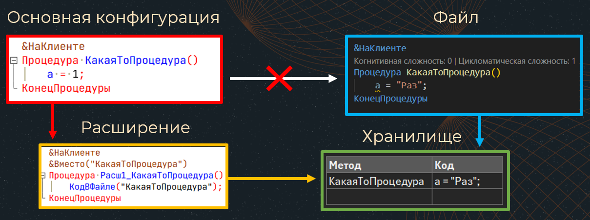

# Чпоньк!

Позволяет писать код в любом редакторе и видеть результат без перезагрузки 1с в режиме 1С:Предприятие

### Возможности!

- Позволяет писать код 1С в файле, а значит, в любом редакторе/IDE
- Избавляет от необходимости перезагрузки предприятия для отладки и тестирования изменений
- При этом не теряется контекст
- Весь код в одном файле, разделен аннотациями

### Как работает?

### Ограничения

- Не рекомендуется использовать на проде
- Нет отладки
- Только управляемые формы
- Версия платформы не менее 8.3.18 (Асинх)
- ОС Windows
- При добавлении «нового» модуля или события требуется перезапуск
- Нет поддержки асинхронных методов и обработчиков оповещения

### Особенности

- Добавление методов без перезагрузки
- Минимум настроек и телодвижений со стороны разработчика 
- Любой редактор файлов
- COMConnector или публикация ИБ на веб-сервере
